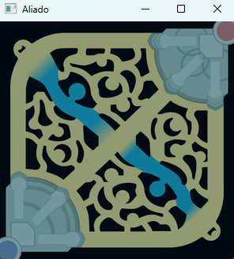
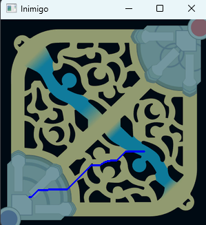
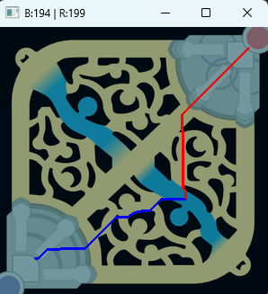
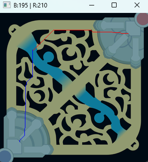
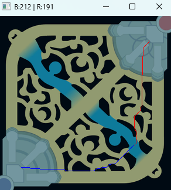

# Calculando o menor caminho com o algoritmo Dijkstra no Summoners Rift em League of Legends

O projeto consiste em achar o menor caminho entre dois pontos (algo que o LoL já faz naturalmente) e avaliar se o <strong>Blue</strong> ou <strong>Red side</strong> possui vantagem naquele(s) ponto(s). Para o projeto foi usada a linguagem <strong>Python</strong> com <strong>OpenCV</strong> para criar um grafo a partir da imagem do mapa e traçar os caminhos.

<h2>Como usar a ferramenta</h2>

1. Escolhe dois pontos no Mapa abaixo para o time aliado (Blue side)

    

2. Após isso escolhe mais dois pontos para o time inimigo (Red side)

    

3. Com isso aparece o menor caminho e a distância dele (Nesse caso o Blue side possui vantagem)

    

<h2>Mostrando na prática:</h2>

<strong>Bush do top:</strong>

    

https://github.com/user-attachments/assets/5a9d6850-6299-49b1-b72a-1761995ed551

<strong>Bush do bot:</strong>

    

https://github.com/user-attachments/assets/2f49116b-5b07-45bb-98db-6f6e16212aa3

---

A ferramenta foi desenvolvida principalmente para colocar meus aprendizados em prática, porém, ainda, acredito que players e times de jogos competitivos, como o League of Legends, podem ser beneficiados com a computação, além da estatística e ciência de dados como estamos acostumados a ver.

